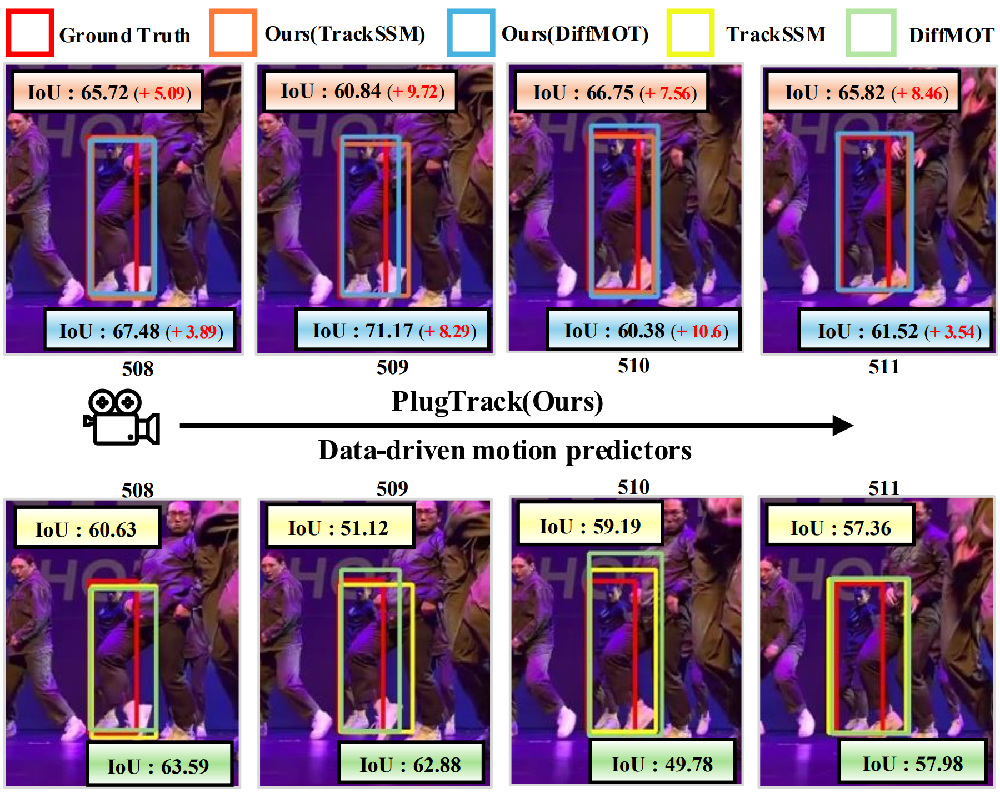

  <h1 align="center">PlugTrack: Multi-Perceptive Motion Analysis   for Adaptive Fusion in Multi-Object Tracking
</h1>
  

    <a href="https://tmdwo8814.github.io/">Seungjae Kim</a>
    &nbsp;·&nbsp;
    <a href="https://my.surfit.io/w/1720083748">SeungJoon Lee</a>
    &nbsp;·&nbsp;
    <a href="https://myeongahcho.netlify.app/">MyeongAh Cho</a>
    &nbsp;·&nbsp;
  

  <h3 align="center">AAAI 2026</h3>
  <h3 align="center"><a href="https://arxiv.org/abs/2511.13105">Paper</a> | <a href="https://github.com/VisualScienceLab-KHU/PlugTrack?tab=readme-ov-file">Project Page</a> | <a href="https://github.com/VisualScienceLab-KHU/PlugTrack?tab=readme-ov-file">Pretrained Models</a> </h3>

 

  

<table>
  <tr>
    <th>Dataset</th>
    <th>HOTA</th>
    <th>IDF1</th>
    <th>Assa</th>
    <th>MOTA</th>
    <th>DetA</th>
  </tr>

  <!-- DanceTrack (left single row -> right two rows) -->
  <tr>
    <td rowspan="2">DanceTrack</td>
    <td>62.3</td>
    <td>63.0</td>
    <td>47.2</td>
    <td>92.8</td>
    <td>82.5</td>
  </tr>
  <tr>
    <!-- second row under DanceTrack -->
    <td colspan="5">
    <td>62.3</td>
    <td>63.0</td>
    <td>47.2</td>
    <td>92.8</td>
    <td>82.5</td>
    </td>
  </tr>

  <tr>
    <td>SportsMOT</td>
    <td>76.2</td>
    <td>76.1</td>
    <td>65.1</td>
    <td>97.1</td>
    <td>89.3</td>
  </tr>
  <tr>
    <td>MOT17</td>
    <td>64.5</td>
    <td>79.3</td>
    <td>64.6</td>
    <td>79.8</td>
    <td>64.7</td>
  </tr>
  <tr>
    <td>MOT20</td>
    <td>61.7</td>
    <td>74.9</td>
    <td>60.5</td>
    <td>76.7</td>
    <td>63.2</td>
  </tr>
</table>

## 🚀 Tracking performance

PlugTrack(DiffMOT)
| Dataset    |  HOTA | IDF1 | Assa | MOTA | DetA | 
|--------------|-----------|--------|-------|----------|----------|
|DanceTrack  | 62.3 | 63.0 | 47.2 | 92.8 | 82.5 | 
|SportsMOT   | 76.2 | 76.1 | 65.1 | 97.1 | 89.3 | 
|MOT17       | 64.5 | 79.3 | 64.6 | 79.8 | 64.7 | 
|MOT20       | 61.7 | 74.9 | 60.5 | 76.7 | 63.2 | 

PlugTrack(TrackSSM)
| Dataset    |  HOTA | IDF1 | Assa | MOTA | DetA | 
|--------------|-----------|--------|-------|----------|----------|
|DanceTrack  | 62.3 | 63.0 | 47.2 | 92.8 | 82.5 | 
|SportsMOT   | 76.2 | 76.1 | 65.1 | 97.1 | 89.3 | 
|MOT17       | 64.5 | 79.3 | 64.6 | 79.8 | 64.7 | 
|MOT20       | 61.7 | 74.9 | 60.5 | 76.7 | 63.2 |